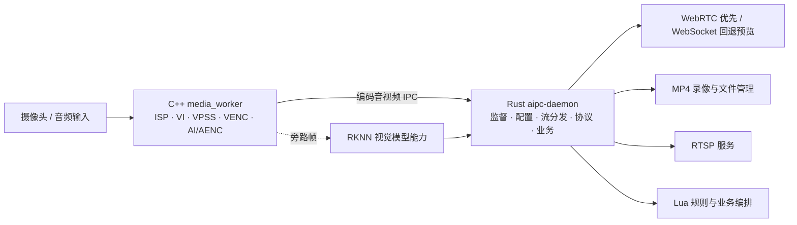

<div align="center">
  <h1>AIPC</h1>
  <p>Rust 业务主进程 + 最小化原生音视频采集服务的嵌入式实验性项目</p>

  <a href="./LICENSE"></a>
  
  
  
  
</div>

---

## 项目定位

AIPC 是一个面向瑞芯微 SoC 的**实验性嵌入式音视频服务项目**。它不是一个已经覆盖所有产品场景的通用媒体框架，而是用于验证我的一个工程设想：

> 在嵌入式音视频开发中，将必须直接访问 ISP、VI、VPSS、VENC、AI/AENC 等硬件 SDK 的部分封装成最小化原生服务；由 Rust 承接复杂的网络协议、音视频流媒体协议、业务编排、配置管理和故障恢复。

当前首先在 Luckfox Pico / RV1106 上验证这套边界，后续计划适配 RK3576 和 RV1126B。项目也计划加入基于 Lua 的业务/规则编排，以及由 RKNN 驱动的视觉模型能力。

由于项目处于架构验证和快速迭代阶段，接口、IPC 协议、配置结构和 SoC 抽象层都可能发生变化，不建议直接作为未经评估的生产级媒体框架使用。

## Web 控制台展示

当前 RV1106 实验版本提供运行概览、Worker 状态、实时预览、H.264/G711A 指标和基础诊断控制。下图为开发板实际运行时的 Web 控制台截图：

<p align="center">
  
</p>

_RV1106 Web 控制台运行概览（实验性界面，后续会随录像管理、RTSP 和 AI 能力继续演进）。_

## 设计设想



职责边界如下：

- `media_worker`：只拥有硬件媒体资源和底层编码生命周期，不负责 HTTP、RTSP、Web UI、录像业务或网络客户端管理。
- `aipc-daemon`：负责 worker 监督、配置冷重启/回滚、编码流分发、HTTP API、Web UI、WebSocket 预览、MP4 录像和 RTSP。
- Lua/RKNN：作为后续业务编排和视觉模型扩展，目标是让模型故障或重启不阻塞主音视频链路。

## 当前能力

- Rust/Tokio/Axum daemon 与 C++17/RKMPI media worker 双进程架构。
- worker generation、启动状态、关键帧、流就绪、指标、异常退出和有界重启回退。
- H.264 Annex-B 编码帧 IPC，包含 PTS、sequence 和关键帧标志。
- WebRTC H.264/PCMA 浏览器预览，失败时自动回退 WebSocket/MSE，慢客户端不会阻塞采集。
- Rust MP4 录像：手动启停、关键帧起录、受管目录、文件索引和磁盘空间保护。
- Web UI 录像管理：原生浏览器 H.264 解码、暂停、进度拖动、倍速、全屏、下载、批量删除和 ZIP 导出。
- Rust 内置 RTSP 服务：`rtsp://<device>:8554/live`，支持 TCP interleaved 和 UDP RTP/RTCP。
- HTTP Range 文件读取，浏览器可在不下载完整文件的情况下拖动 MP4 进度。
- ADB + 以太网联合部署验证流程，当前已在 RV1106 真机上验证 HTTP、MP4、Range、ZIP 和 RTSP TCP/UDP。

## 功能实现矩阵

状态说明：✅ 已实现并验证　🧪 实验性可用　🚧 计划实现/适配　⬜ 尚未开始　— 不适用或待定义

| 功能 / 子系统 | 当前状态 | RV1106 | RK3576 | RV1126B | 说明 |
| :--- | :---: | :---: | :---: | :---: | :--- |
| 最小化 C++ 媒体 worker | 🧪 | 🧪 已验证 | 🚧 | 🚧 | 当前使用 RKMPI/ISP/VI/VPSS/VENC，需按 SoC 重做硬件适配层 |
| H.264 视频编码 | 🧪 | ✅ | 🚧 | 🚧 | RV1106 真机已验证 1920×1080/30 FPS |
| G711A 音频采集/编码 | 🧪 | 🧪 | 🚧 | 🚧 | 仅有 worker 侧实验性诊断输出，尚未接入 Rust 主流分发和 MP4/RTSP |
| Rust worker 监督与冷重启回滚 | ✅ | ✅ | 🚧 | 🚧 | generation、启动超时、异常退出和 last-good 配置 |
| 编码视频 IPC / VideoHub | 🧪 | ✅ | 🚧 | 🚧 | 当前协议面向 Rust daemon，后续需验证跨 SoC 时基和码流差异 |
| WebSocket 实时预览 | ✅ | ✅ | 🚧 | 🚧 | Vue + jMuxer/MSE |
| Rust WebRTC 音视频分发 | 🧪 | 🧪 | 🚧 | 🚧 | str0m、H.264 High Profile、PCMA、LAN-only ICE-lite |
| Rust MP4 录像 | 🧪 | ✅ | 🚧 | 🚧 | H.264 视频，音频轨道尚未加入 |
| 浏览器 MP4 播放 | 🧪 | ✅ | 🚧 | 🚧 | 依赖浏览器 H.264 解码能力和 HTTP Range |
| Rust 内置 RTSP | 🧪 | ✅ | 🚧 | 🚧 | TCP interleaved、UDP RTP/RTCP、H.264 RTP 分包 |
| 录像文件管理与批量导出 | 🧪 | ✅ | 🚧 | 🚧 | 列表、下载、ZIP 导出、批量删除 |
| Lua 规则/业务编排 | ⬜ | ⬜ | ⬜ | ⬜ | 计划用于事件规则、任务编排和用户扩展 |
| RKNN 视觉模型推理 | ⬜ | ⬜ | ⬜ | ⬜ | 计划从 media worker 旁路帧或独立 AI worker 接入 |
| AI worker 故障隔离 | ⬜ | ⬜ | ⬜ | ⬜ | 目标是模型重启不影响主音视频和网络客户端 |
| RK3576 适配 | ⬜ | — | 🚧 | — | 待建立统一 SoC 媒体能力和构建抽象 |
| RV1126B 适配 | ⬜ | — | — | 🚧 | 待验证 SDK、ISP、编码器和板端部署差异 |

矩阵中的“已验证”主要指当前 RV1106 开发板和本仓库已有部署流程，不代表已完成所有分辨率、码率、存储介质、网络条件和长时间稳定性测试。

## 开发与构建

### 主机测试

```bash
cargo test --workspace
npm --prefix webui test
npm --prefix webui run build

cmake --preset HostDebug -S media_worker
cmake --build media_worker/build/HostDebug
ctest --test-dir media_worker/build/HostDebug --output-on-failure
```

主机 Cargo 构建会跳过硬件 worker；C++ HostDebug preset 只构建与硬件无关的配置、IPC 和指标测试。

### RV1106 交叉编译与打包

构建脚本默认从当前仓库的上级目录寻找 Luckfox SDK，也可以通过 `AIPC_SDK_ROOT` 覆盖：

```bash
./scripts/build-rv1106.sh
./scripts/package-rv1106.sh
```

打包目录为 `target/package/aipc-rust`，包含：

```text
bin/       Rust daemon 与 C++ media worker
config/    daemon / worker 配置
scripts/   启停、部署和板端脚本
www/       Vue 生产构建产物
```

### ADB 与以太网部署验证

如果 Luckfox 通过 USB ADB 连接到开发机，并通过以太网连接到同一局域网：

```bash
./scripts/package-rv1106.sh
AIPC_SKIP_BUILD=1 ./scripts/deploy-rv1106-adb.sh
./scripts/validate-rv1106-adb.sh
```

也可以使用已安装的 `luckfox-board-debug` Codex skill 执行板端探测、ADB 检查、HTTP/Range、录像和 RTSP 验证。

默认服务地址：

- HTTP/Web UI：`http://<board-ip>:8080`
- RTSP：`rtsp://<board-ip>:8554/live`
- WebRTC 媒体：`udp://<board-ip>:10000`（信令复用 HTTP API）
- 默认部署目录：`/root/aipc-rust`
- 默认录像目录：`/root/aipc-rust/recordings`

daemon 当前未启用身份认证，只应暴露在可信局域网中。

## 路线图

1. 稳定 RV1106 的媒体 worker、录像和 RTSP 长时间运行能力。
2. 抽象 SoC 相关的 ISP、VI、VPSS、VENC、AI/AENC 和构建配置，开始 RK3576/RV1126B 适配。
3. 将音频编码流接入 Rust VideoHub/MediaHub，完善音视频同步和带音频封装。
4. 引入独立 RKNN AI worker 和旁路帧协议，保证视觉模型故障不影响主码流。
5. 引入 Lua 规则和业务编排层，承接告警、任务、模型结果和用户扩展逻辑。
6. 根据多 SoC 实测结果稳定 IPC、配置和网络协议兼容层。

## 仓库结构

- `aipc-daemon/`：Rust daemon、API、worker supervisor、录像和 RTSP。
- `media_worker/`：独立 C++17/RKMPI 硬件媒体 worker。
- `webui/`：Vue 3 管理台、实时预览和录像播放器。
- `config/`：daemon 打包配置示例。
- `deploy/`、`scripts/`：构建、打包、ADB 部署和板端验证脚本。
- `docs/`：架构蓝图、运行时架构和调试说明。
- `3rdparty/`：当前 RV1106 构建所需的 RKMPI 和 JSON 依赖。

## 许可证

Copyright 2026 AIPC contributors.

AIPC 使用 [Apache License 2.0](./LICENSE) 开源，SPDX 标识为 `Apache-2.0`。

除非适用法律另有要求或书面同意，软件按许可证规定的“原样”提供，不附带任何明示或默示担保。贡献者提交代码即表示其贡献按本仓库许可证授权；第三方组件仍以其各自许可证为准。

欢迎通过 Issue 和 Pull Request 讨论 SoC 适配、媒体协议、Lua/RKNN 集成和稳定性问题。
