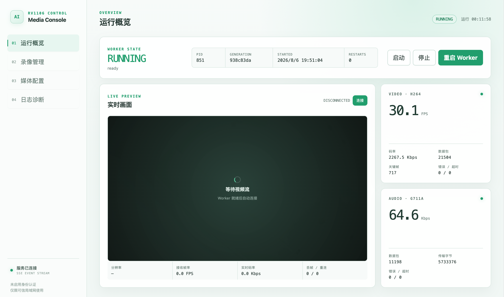
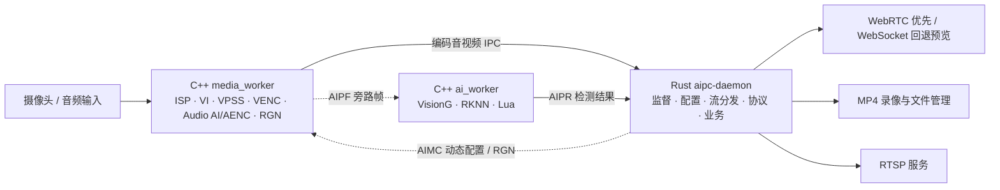

<div align="center">
  <h1>AIPC</h1>
  <p>Rust 控制面 + C++ 媒体/AI worker 的嵌入式音视频与视觉实验项目</p>

  <a href="./LICENSE"></a>
  
  
  
  
</div>

---

## 项目定位

AIPC 是一个面向瑞芯微 SoC 的**实验性嵌入式音视频服务项目**。它不是一个已经覆盖所有产品场景的通用媒体框架，而是用于验证我的一个工程设想：

> 在嵌入式音视频开发中，将必须直接访问 ISP、VI、VPSS、VENC、音频 AI/AENC 等硬件 SDK 的部分封装成最小化原生服务；由 Rust 承接复杂的网络协议、音视频流媒体协议、业务编排、配置管理和故障恢复。

当前首先在 Luckfox Pico / RV1106 上验证这套边界，已经实现独立 AI worker、受限 Lua 项目运行时、VisionG/RKNN 推理、动态 AI VPSS 输入，以及不阻塞编码链路的 metadata / 硬件 RGN OSD。后续计划适配 RK3576 和 RV1126B，并继续稳定多模型和长时间运行能力。

由于项目处于架构验证和快速迭代阶段，接口、IPC 协议、配置结构和 SoC 抽象层都可能发生变化，不建议直接作为未经评估的生产级媒体框架使用。

## Web 控制台展示

当前 RV1106 实验版本提供运行概览、三进程状态、实时预览、录像与 RTSP 管理、AI/Lua 项目管理、模型上传、OSD 控制和日志诊断。下图为开发板实际运行时的 Web 控制台截图：

<p align="center">
  
</p>

_RV1106 Web 控制台运行概览（实验性界面，具体布局会继续演进）。_

## 当前架构



职责边界如下：

- `media_worker`：独占 ISP、VI、VPSS、VENC、音频 AI/AENC 和 RGN；主路保持硬件绑定，AI 旁路独立抓帧并采用 latest-only 队列。
- `aipc-daemon`：负责两个 worker 的独立监督、动态参数注入、配置与 last-good 回滚、流分发、HTTP/Web UI、WebRTC、录像、RTSP 和 OSD 策略。
- `ai_worker`：独立承载 VisionG/RKNN 和受限 Lua 项目，从 AIPF 读取 NV12 帧并输出 AIPR；推理变慢、脚本错误或进程重启均不重建主视频链路。

## 当前能力

- Rust/Tokio/Axum daemon、C++17/RKMPI media worker 与 C++17/VisionG ai worker 三进程架构，media 与 AI 生命周期相互隔离。
- worker generation、启动状态、关键帧、流就绪、指标、异常退出、有界重启和 last-good 回退。
- H.264 Annex-B、G711A 和 NV12 AI 旁路 IPC；固定 FD 契约，AIPV/AIPA/AIPF 使用固定二进制头，AIPR/AIMC 使用受限长度前缀 JSON。
- WebRTC H.264/PCMA 浏览器预览，失败时自动回退 WebSocket/MSE，慢客户端不会阻塞采集。
- Rust MP4 录像：手动启停、关键帧起录、由 G711A 解码生成的 WAV 伴随音频、受管目录、文件索引和磁盘空间保护。
- Web UI 录像管理：原生浏览器 H.264 解码、暂停、进度拖动、倍速、全屏、下载、批量删除和 ZIP 导出。
- Rust 内置 RTSP 服务：`rtsp://<device>:8554/live`，支持 TCP interleaved 和 UDP RTP/RTCP。
- HTTP Range 文件读取，浏览器可在不下载完整文件的情况下拖动 MP4 进度。
- AI VPSS 通道号、宽高、FPS、NV12、depth/buffer 和 fit mode 全部由激活项目 manifest 注入，已验证 `640×360/stretch` 与 `640×640/contain` 在线切换。
- Lua 项目 CRUD、语法/manifest 校验、不可变候选部署、首次推理验收和 last-good 自动回滚；模型支持原子上传和活动引用保护。
- VisionG v1.2.1 + YOLOv5n COCO80 RKNN 已在 RV1106 真机持续运行，640×640 推理约 75 ms、结果约 10 FPS。
- VisionG 的 `(x, y, width, height)` 检测结果会转换为统一角点坐标，再依据 stretch/contain/cover 变换映射到主路归一化坐标，避免模型输入、letterbox 与输出画面尺寸不同造成框偏移。
- OSD 三态：`off`、默认 `metadata`、`embedded_rgn`。metadata 通过 WebRTC DataChannel/SSE 平滑叠加；embedded 在 RV1106 使用 `COVER_RGN@VI`，运行时探测 VI 原始坐标尺寸并从主路坐标域缩放，可进入 WebRTC、RTSP 和 MP4，且不使用同步 RGA 合成。
- ADB + 以太网/Wi-Fi 联合部署验证流程；已验证 HTTP、WebRTC、MP4/Range、ZIP、RTSP TCP/UDP、AI 崩溃恢复和 10 分钟持续运行。

## 功能实现矩阵

状态说明：✅ 已实现并验证　🧪 实验性可用　🚧 计划实现/适配　⬜ 尚未开始　— 不适用或待定义

| 功能 / 子系统 | 当前状态 | RV1106 | RK3576 | RV1126B | 说明 |
| :--- | :---: | :---: | :---: | :---: | :--- |
| 最小化 C++ 媒体 worker | 🧪 | 🧪 已验证 | 🚧 | 🚧 | 当前使用 RKMPI/ISP/VI/VPSS/VENC，需按 SoC 重做硬件适配层 |
| H.264 视频编码 | 🧪 | ✅ | 🚧 | 🚧 | RV1106 真机已验证 1920×1080/30 FPS |
| G711A 音频采集/编码 | 🧪 | ✅ | 🚧 | 🚧 | 已接入 Rust 分发、WebRTC PCMA 和录像伴随音频；尚未复用到 MP4/RTSP 音轨 |
| Rust worker 监督与冷重启回滚 | ✅ | ✅ | 🚧 | 🚧 | generation、启动超时、异常退出和 last-good 配置 |
| 编码视频 IPC / VideoHub | 🧪 | ✅ | 🚧 | 🚧 | 当前协议面向 Rust daemon，后续需验证跨 SoC 时基和码流差异 |
| WebSocket 实时预览 | ✅ | ✅ | 🚧 | 🚧 | Vue + jMuxer/MSE |
| Rust WebRTC 音视频分发 | 🧪 | 🧪 | 🚧 | 🚧 | str0m、H.264 High Profile、PCMA、LAN-only ICE-lite |
| Rust MP4 录像 | 🧪 | ✅ | 🚧 | 🚧 | H.264 视频，音频轨道尚未加入 |
| 浏览器 MP4 播放 | 🧪 | ✅ | 🚧 | 🚧 | 依赖浏览器 H.264 解码能力和 HTTP Range |
| Rust 内置 RTSP | 🧪 | ✅ | 🚧 | 🚧 | TCP interleaved、UDP RTP/RTCP、H.264 RTP 分包 |
| 录像文件管理与批量导出 | 🧪 | ✅ | 🚧 | 🚧 | 列表、下载、ZIP 导出、批量删除 |
| Lua AI 项目编排 | 🧪 | ✅ | 🚧 | 🚧 | 受限 Lua 5.4.8 运行时、项目校验、部署和 last-good 回滚 |
| RKNN 视觉模型推理 | 🧪 | ✅ | 🚧 | 🚧 | VisionG v1.2.1、YOLOv5、动态 640×360/640×640 AI VPSS |
| AI worker 故障隔离 | 🧪 | ✅ | 🚧 | 🚧 | AI 独立重启，主 VPSS/VENC generation 保持不变 |
| 浏览器 metadata OSD | 🧪 | ✅ | 🚧 | 🚧 | WebRTC DataChannel + SSE fallback、归一化坐标、插值/外推和过期淡出 |
| 编码流硬件 RGN OSD | 🧪 | ✅ | 🚧 | 🚧 | RV1106 使用 COVER_RGN@VI，动态探测并映射 VI 坐标域；RTSP、WebRTC 和 MP4 均可带框 |
| RK3576 适配 | ⬜ | — | 🚧 | — | 待建立统一 SoC 媒体能力和构建抽象 |
| RV1126B 适配 | ⬜ | — | — | 🚧 | 待验证 SDK、ISP、编码器和板端部署差异 |

矩阵中的“已验证”主要指当前 RV1106 开发板和本仓库已有部署流程，不代表已完成所有分辨率、码率、存储介质、网络条件和长时间稳定性测试。

## 开发与构建

### 主机测试

```bash
cargo test --workspace
npm --prefix webui test
npm --prefix webui run build

cd native
cmake --preset HostDebug
cmake --build --preset HostDebug
ctest --preset HostDebug
```

Cargo 不再隐式构建 C++。`native` 总工程统一构建两个 worker、公共协议库和 host CTest。
第三方 C++ 依赖统一由 CMake FetchContent 获取并固定版本/hash，支持标准
`FETCHCONTENT_SOURCE_DIR_<NAME>` 离线覆盖。详细版本、缓存和离线构建方式见
[`docs/native_build.md`](./docs/native_build.md)。

### RV1106 交叉编译与打包

构建脚本默认从当前仓库的上级目录寻找 Luckfox SDK，也可以通过 `AIPC_SDK_ROOT` 覆盖：

```bash
./scripts/build-rv1106.sh    # 只构建三个进程
./scripts/package-rv1106.sh  # 构建并生成完整部署包
```

打包目录为 `target/package/aipc-rust`，包含：

```text
bin/       aipc-daemon、media_worker、ai_worker
config/    daemon / worker 配置
scripts/   启停、部署和板端脚本
www/       Vue 生产构建产物
lib/       VisionG 运行时动态库
licenses/  VisionG、Lua 及 AI worker 第三方声明
seed/      首次启动时导入的示例 Lua 项目与 YOLOv5 模型
```

### ADB 与以太网部署验证

如果 Luckfox 通过 USB ADB 连接到开发机，并通过以太网连接到同一局域网：

```bash
./scripts/package-rv1106.sh
AIPC_SKIP_BUILD=1 ./scripts/deploy-rv1106-adb.sh
./scripts/validate-rv1106-adb.sh
```

多设备环境可设置 `AIPC_ADB_SERIAL`。部署采用 staging + previous 目录切换，并在新包
启动前恢复原有 `data/`，不会覆盖用户的 AI 项目、模型、状态和录像索引。

也可以使用已安装的 `luckfox-board-debug` Codex skill 执行板端探测、ADB 检查、HTTP/Range、录像和 RTSP 验证。

默认服务地址：

- HTTP/Web UI：`http://<board-ip>:8080`
- RTSP：`rtsp://<board-ip>:8554/live`
- WebRTC 媒体：`udp://<board-ip>:10000`（信令复用 HTTP API）
- 默认部署目录：`/root/aipc-rust`
- 默认录像目录：`/root/aipc-rust/recordings`

daemon 当前未启用身份认证，只应暴露在可信局域网中。

## AI、Lua 与 OSD 快速使用

完整包第一次启动时会将 `yolov5-coco80` 示例项目、YOLOv5n RKNN 模型和 COCO80
标签复制到持久化目录；已有同名文件不会被覆盖：

```text
/root/aipc-rust/data/ai/
  models/
  projects/
  deployments/
  state.json
```

打开 Web 控制台的“AI 与 Lua 管理”页面即可：

1. 查看 AI worker、动态 VPSS、推理 FPS/耗时、丢帧、RGN 能力和最近错误。
2. 编辑项目 manifest 与 `main.lua`，执行校验后部署候选版本。
3. 上传或删除 RKNN/标签资源；活动项目或 last-good 引用的模型不能删除。
4. 在 `off`、`metadata` 和 `embedded_rgn` 之间切换 OSD。

项目 manifest 是 AI 输入参数的唯一权威来源。切换输入尺寸时只在线重配 AI VPSS
通道；失败会恢复 last-good 项目，不会重启主 VPSS、VENC 或 media worker。metadata
只影响浏览器叠加，RTSP/MP4 保持原始画面；embedded 是全局硬件叠加，所有编码输出
都会带矩形框。

检测结果在进程间统一使用主路归一化坐标。AI worker 会将 VisionG 返回的 `xywh`
转换为角点并反解模型输入的缩放、裁剪或 letterbox；media worker 则在启用硬件 RGN
时查询 VI 的实际坐标尺寸（RV1106 实测为传感器原始坐标域），再按归一化边界完成
缩放。这样浏览器 metadata、WebRTC、RTSP 和录像中的 embedded 框使用同一目标位置，
且坐标转换不会进入 VENC 的同步关键路径。接口和协议细节见
[`docs/ai_worker_lua_architecture.md`](./docs/ai_worker_lua_architecture.md)。

## 路线图

1. 延长 RV1106 并发预览、RTSP、录像和 AI 的持续运行与故障注入测试。
2. 完善音视频同步，将 G711A/PCMA 复用进录像容器和 RTSP 音轨。
3. 扩展 VisionG backend 与 Lua API，验证更多 RKNN 模型、输入尺寸和后处理实现。
4. 抽象 SoC 相关的 ISP、VI、VPSS、VENC、音频和 RGN 能力，开始 RK3576/RV1126B 适配。
5. 根据多 SoC 实测结果稳定 IPC、配置、硬件 OSD 能力探测和网络协议兼容层。

## 仓库结构

- `aipc-daemon/`：Rust daemon、API、worker supervisor、录像和 RTSP。
- `media_worker/`：C++17/RKMPI 硬件媒体 worker，包含主视频图、动态 AI 输入和 RGN。
- `ai_worker/`：C++17 VisionG/RKNN worker、Lua 沙箱、manifest 和推理 backend。
- `native/`：两个 C++ worker 的唯一 CMake 总工程、公共 IPC 库、FetchContent 和 toolchain。
- `webui/`：Vue 3 管理台、WebRTC/WebSocket 预览、AI 管理和录像播放器。
- `config/`：daemon 打包配置示例。
- `deploy/`、`scripts/`：构建、打包、ADB 部署和板端验证脚本。
- `docs/`：架构蓝图、运行时架构和调试说明。
- `testdata/protocol/`：Rust/C++ 共用的协议 golden fixture。

## 许可证

Copyright 2026 AIPC contributors.

AIPC 使用 [Apache License 2.0](./LICENSE) 开源，SPDX 标识为 `Apache-2.0`。

除非适用法律另有要求或书面同意，软件按许可证规定的“原样”提供，不附带任何明示或默示担保。贡献者提交代码即表示其贡献按本仓库许可证授权；第三方组件仍以其各自许可证为准。

欢迎通过 Issue 和 Pull Request 讨论 SoC 适配、媒体协议、Lua/RKNN 集成和稳定性问题。
