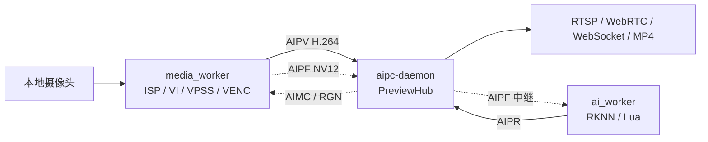
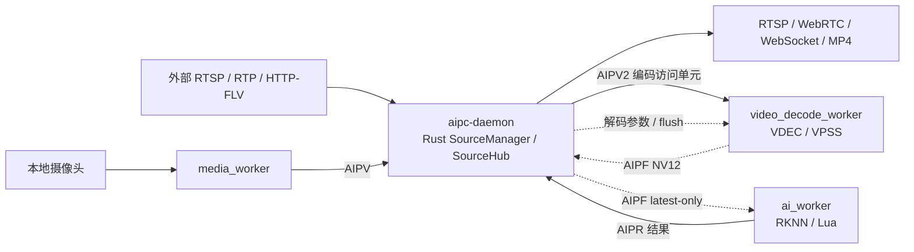

# AIPC 外部输入视频流架构设计建议

本文基于当前 `main` 分支（已与 `origin/main` 同步）和现有实现整理，讨论如何把网络摄像机、RTSP 推流器或其他外部视频源接入 AIPC，并支持以下两类业务：

1. 只获取外部输入，由 Rust 进程负责 RTSP/WebRTC/WebSocket/录像等流分发；
2. 获取外部输入后送入 AI 进程处理，再分发原始流、叠加流或处理后的视频流。

本文的核心建议是：把“输入源”“AI 处理”“网络分发”解耦；Rust 继续作为唯一网络控制面和分发面，新增的原生处理 worker 只负责硬件媒体转换，AI worker 继续作为旁路计算进程。

## 1. 当前框架基线

当前代码已经形成了比较清晰的进程边界：

| 进程 | 当前职责 | 已有接口 |
| --- | --- | --- |
| `aipc-daemon`（Rust） | 配置、HTTP/Web UI、worker 监督、流分发、RTSP、WebRTC、录像、AI 结果聚合 | `PreviewHub/VideoHub`、AIPV、AIPA、AIPF 中继、AIPR、AIMC |
| `media_worker`（C++） | 独占 ISP、VI、VPSS、VENC、音频 AI/AENC、RGN；当前输入是本地摄像头 | fd 3 输出 AIPV/H.264，fd 4 输出 AIPA/G711A，fd 5 输出 AIPF/NV12，fd 6 AIMC 控制 |
| `ai_worker`（C++） | VisionG/RKNN/Lua 推理和后处理 | fd 3 输入 AIPF，fd 4 输出 AIPR |

目前的数据流是：



这套边界有三个重要事实：

- `PreviewHub` 已经是 Rust 侧的公共媒体总线，RTSP、WebRTC、录像都从这里消费，不应为外部输入另起一套分发实现。
- AIPF 是“最新帧优先”的 AI 旁路，`ai_worker` 变慢或重启不会阻塞主视频编码。
- 当前 `media_worker` 初始化的是 `ISP → VI → VPSS → VENC`，外部 RTSP 输入不能简单地塞进现有 VI 通道；网络接入和解码应有独立生命周期。

## 2. 先区分三种业务模式

“AI 处理后再分发”可能代表三种不同需求，必须在配置和接口层明确区分：

### 模式 A：编码流透传

外部源已经是 H.264（优先）编码。系统只做 RTSP/RTP 接收、解包和时间戳整理，Rust 直接分发同一份编码码流。

```text
外部 RTSP/RTP → Rust（接收/解包）→ SourceHub → 各类下游
```

优点是延迟和 CPU/内存开销最低，不需要解码；缺点是无法做逐帧 AI，也无法保证外部码流满足浏览器 H.264 profile、关键帧和 SPS/PPS 要求。

### 模式 B：AI 旁路分析

Rust 保留原始编码流用于直接分发，并把同一批编码访问单元送入无网络的处理 worker；处理 worker 通过硬件解码/VPSS 生成低分辨率 NV12，送给现有 `ai_worker`。AI 返回检测结果，Rust 负责 metadata 和告警。第一版不修改原始编码码流。

```text
外部 H.264 → Rust SourceManager → SourceHub → 分发
                              └→ processor(VDEC/VPSS) → AIPF → ai_worker → AIPR → Rust
```

这是最适合当前框架的第一种 AI 方案：AI 失败只影响结果和 OSD，不影响外部原始流。

### 模式 C：AI/算法改变视频内容

例如去噪、分割着色、超分、打码或模型输出需要重新编码。这不是当前 AIPR 结果接口能表达的能力，必须增加“处理后视频”数据面：

```text
外部 H.264 → Rust → processor(VDEC/VPSS) → AI/滤镜
                                            └→ NV12 → VENC → AIPV → Rust → 分发
```

检测框、计数等常见场景不应走模式 C；优先采用模式 B，由浏览器/WebRTC metadata 叠加。只有必须把结果烧录到 RTSP/录像码流时，才增加硬件 RGN/VENC 输出链路。

## 3. 推荐的目标架构

### 3.1 Rust 网络输入管理器 + 单一职责视频处理 worker

如果目标是尽可能把网络连接放进 Rust，那么新增进程不应再叫“external input worker”，因为它不负责连接外部网络。第一版建议把它严格定义为 `video_decode_worker`：只接收 Rust 整理好的编码访问单元，执行硬件 VDEC 和 VPSS 缩放/裁剪，再输出 AIPF/NV12。不要在第一版同时加入 RTSP、VENC、RGN 或 AI 业务逻辑。



职责建议如下：

| 组件 | 应该负责 | 不应该负责 |
| --- | --- | --- |
| Rust daemon | source 注册与选择、配置持久化、worker 监督、SourceHub/VideoHub、所有对外协议和录像 | 直接持有 RKMPI/VDEC 资源；在 Tokio 任务中执行重型解码 |
| `video_decode_worker` | 接收 AIPV2 编码访问单元、VDEC/VPSS、输出 AIPF/NV12 | 任何网络连接、DNS、鉴权、重连、VENC/RTSP server、AI 业务规则 |
| `media_worker` | 保持现有本地摄像头链路 | 外部网络源和输入源切换业务 |
| `ai_worker` | RKNN/Lua 推理、预处理/后处理、AIPR 或可选原始帧输出 | 网络接收、流分发、录像、源生命周期 |

这样做的主要收益是：网络协议和凭据只在 Rust 中出现；解码器异常只会重启处理 worker；外部源断线不会占用原生进程的网络状态机；本地摄像头、Rust 分发和 AI worker 的故障域不会被扩大。

### 3.2 Rust 侧统一“源”抽象

不要让 `PreviewHub` 继续隐含“只有 camera0”。建议在其上增加 `SourceHub` 或将 `VideoHub` 泛化为按 `source_id` 分片的媒体总线：

```text
SourceManager
  ├─ camera0  → media_worker → VideoHub(camera0)
  └─ ext0     → Rust SourceManager → VideoHub(ext0)
```

RTSP、WebRTC、WebSocket 和录像 API 都通过 `source_id` 选择输入源；现有单摄像头接口可把 `camera0` 作为默认值保持兼容。

## 4. 网络连接全部放在 Rust 的设计

### 4.1 Rust `ExternalSourceManager`

每个外部源由一个 Rust actor 管理，不能由 HTTP handler 或共享的无界任务直接持有连接。actor 的职责是：

- DNS、TCP/TLS、RTSP `OPTIONS/DESCRIBE/SETUP/PLAY`、UDP 或 TCP interleaved 选择；
- RTP/RTCP 接收、H.264 FU-A/STAP-A 重组、SPS/PPS 缓存和访问单元组装；
- 源时间戳到本地单调时间的映射、乱序和抖动缓冲；
- 连接超时、读包超时、鉴权失败、断线重连和指数退避；
- 产生 `source_generation`，在源重连、codec config 变化或 URI 变更时切换 generation；
- 将完整编码访问单元以 `Arc<Bytes>` 同时发布给 `SourceHub` 和视频处理 worker，避免重复拷贝。

Rust 只做网络和字节流处理，不在 Tokio 任务中做 H.264 解码、RGA 转换或 RKNN 推理。

### 4.2 处理 worker 的输入输出

`video_decode_worker` 只看见本机 IPC，不知道外部 URL、账号、网络地址或重连策略：

```text
Rust ExternalSourceManager
        │ AIPV2 access unit（有界、关键帧感知）
        ▼
video_decode_worker
  VDEC → VPSS → AIPF(NV12)
```

建议使用独立的继承 fd：

| fd | 方向 | 内容 |
| --- | --- | --- |
| 3 | Rust → worker | AIPV2 编码访问单元，包含 config/keyframe/discontinuity 标志 |
| 4 | worker → Rust | AIPF v1 NV12 AI 输入或处理后原始帧 |
| 5 | 预留 | 第一版不使用；未来可供独立输出 worker 使用 |
| 6 | 双向 | 长度前缀 JSON 控制和状态 |

透传模式不需要启动该 worker；只有启用 AI 旁路时才启动，从而让“只分发外部码流”路径没有额外的解码开销。如果未来需要像素级处理后视频，优先增加独立的 `video_output_worker`；只有板端零拷贝和 DMA-BUF 约束证明跨进程代价不可接受时，才考虑把 VENC 合并进同一原生进程。

### 4.3 为什么不让 Rust 直接解码

网络连接放在 Rust 与“Rust 负责解码”是两件事。RV1106 上解码、缩放、颜色转换和重新编码会消耗硬件资源、内存带宽和较大的 native 依赖；把这些操作放入 Rust 控制面会使 Tokio runtime、网络客户端和媒体资源共享故障边界。合适的边界是：Rust 管理连接和数据流，原生 worker 管理硬件媒体转换。

## 5. 进程间数据契约

### 5.1 编码视频：从 AIPV v1 演进到 AIPV v2

现有 AIPV v1 头部只有 flags、payload length、PTS 和 sequence，默认由 supervisor 注入宽高和 H.264 信息。对于多源和外部码流，建议新增向后兼容的 AIPV v2，至少携带：

- `source_id` 或 source hash；
- `source_generation` / `stream_generation`；
- codec（H.264/H.265/AV1）与封装格式（Annex-B/AVCC）；
- `pts`、可选 `dts`、duration、sequence；
- keyframe、discontinuity、config（SPS/PPS/VPS changed）标志；
- width、height、fps、timebase 或在 `StreamInfo` 事件中声明的 codec capability。

第一版仍可只实现 H.264 Annex-B，并在 Rust 接收端把 AIPV v1 适配为统一内部帧结构；不要通过“猜测码流内容”补齐 source 信息。

### 5.2 AI 输入：复用 AIPF v1，泛化 generation 语义

现有 AIPF 已携带 NV12 stride、PTS、sequence、主路尺寸和 crop/pad 变换，适合外部解码后的 AI 输入。建议：

- 保留 AIPF v1 的二进制布局，避免重复造一套 raw-frame 协议；
- 在 Rust 内部结构中增加 `source_id` 和 `input_generation`，由外层 envelope 或当前 fd 会话绑定；
- 继续使用 latest-only 队列，AI 处理不过来时丢旧帧；
- 只在必须跨进程传递处理后像素时，新增 `AIPF_OUT`/`AIPF2`，不要把处理后图像伪装成 AIPR。

### 5.3 AI 结果：AIPR/CloudEvents 增加 source 维度

当前 AI 结果已经包含 media generation、PTS、模型和检测框。外部输入场景还需要：

- `source_id`；
- `source_generation` 和 `ai_generation`；
- 输入丢帧数、源时间戳与本地接收时间（便于延迟诊断）；
- 当源重连或码流 discontinuity 时发送 generation/lifecycle 事件。

现有 CloudEvents API 可继续复用，只需把 `camera0` 从隐含默认值改成显式字段。

### 5.4 控制面：Rust 管网络配置，worker 只接受媒体参数

源 URL、鉴权和重连配置只进入 Rust `ExternalSourceManager`，绝不通过 worker 控制通道传递。worker 的低频控制继续使用长度前缀 JSON，只接受硬件媒体参数和 flush/reconfigure 命令：

```json
{
  "version": 1,
  "request_id": "...",
  "command": "configure_processor",
  "source_generation": "g-123",
  "input_codec": "h264",
  "input_format": "annexb",
  "max_width": 1920,
  "max_height": 1080,
  "output": "ai_frames",
  "ai_width": 640,
  "ai_height": 360,
  "ai_fps": 10
}
```

网络配置变更由 Rust actor 完成；需要更换解码参数时，Rust 先暂停输入、发送 `flush`，再启动新的 processor generation。URL、用户名和密码不能写入 worker 日志、stdout 事件或 AIPV payload；建议配置文件只保存 secret 引用，实际凭据由受限文件或环境注入。

## 6. 时间戳、generation 与切换

外部 RTSP 的 RTP 时间戳和本地单调时钟不能混为一个字段。建议同时保留：

- `source_pts`：源 RTP/容器时基中的 PTS；
- `arrival_monotonic_us`：设备本地接收时间；
- `pts_us`：Rust 分发/录像统一使用的单调微秒时间戳；
- `sequence`：每个 source generation 内单调递增。

generation 建议分三层：

| 名称 | 变化时机 | 用途 |
| --- | --- | --- |
| `source_generation` | source URL、传输方式变化或 Rust source actor 重连 | 标记一次源会话，AI 结果和重连诊断使用 |
| `stream_generation` | codec、分辨率、SPS/PPS 或输出编码参数变化 | 使 RTSP/WebRTC/录像消费者重新建 codec 状态 |
| `ai_generation` | AI 项目、模型或 AI worker 重启 | 结果关联和 last-good 回滚 |

Rust `ExternalSourceManager` 至少应发出 `Connecting`、`Connected`、`StreamInfo`、`StreamReady`、`StreamStalled`、`Reconnecting`、`FatalError`、`Stopped`；processor worker 只需发出 `DecoderReady`、`AiInputReady`、`ProcessedStreamReady`、`StreamStalled` 和 `FatalError`。只有收到有效 codec config 且拿到关键帧后，Rust 才把新的 stream 标记为可用。

配置切换沿用现有 desired/pending/active/last-good 事务：

1. 写入 candidate 配置并启动新 source generation；
2. 等待 `StreamInfo + StreamReady(keyframe)`，必要时等待 AI 首次输入；
3. 原子替换对应 `SourceHub` 的当前 generation；
4. 旧 worker 延迟到消费者完成切换后停止；
5. 超时或失败恢复 last-good。

外部源切换比本地 camera 冷重启更适合“新旧短暂并行”，这样不会因为等待首个关键帧而让所有客户端立即断流；第一版也可以先采用现有冷切换逻辑。

## 7. 缓冲、丢帧和故障边界

- **网络抖动缓冲**：Rust source actor 内设固定上限的 RTP jitter buffer，按时间戳丢弃过期包；不能无限等待缺失包。
- **Rust → processor 队列**：复用现有 keyframe-aware `VideoFrameQueue` 语义。队列溢出时清空到下一个关键帧，并记录 `discontinuity`，不能把慢解码器反压到 RTSP 读取任务。
- **AI 原始帧队列**：latest-only，容量 1～2；AI 推理慢时只增加 drop 计数，不阻塞 VDEC/VPSS。
- **Rust 下游队列**：每个 RTSP/WebRTC/录像消费者独立有界，单个客户端落后只断开或丢弃自身数据。
- **断线恢复**：连接、鉴权、DNS、RTP 超时都归类为 Rust source actor 可恢复故障；采用指数退避和最大重试窗口，连续失败后由 supervisor 进入 `Backoff/Failed`。processor 只处理输入 EOF、解码错误和硬件超时。
- **AI 故障**：AI worker 崩溃、脚本异常、结果延迟不得影响 AIPV 原始流；处理后视频模式下，原始流仍应保留为 fallback。
- **资源隔离**：processor 不共享 camera `media_worker` 的 VPSS/VENC channel ID；启动时检查 VDEC/VPSS/VENC 通道、内存和 DMA buffer 预算。

## 8. 配置和 API 形态

外部源配置应放在 Rust daemon 配置域，而不是直接扩展现有 `media_worker` 的 camera-only JSON。建议形态如下（字段名可调整）：

```json
{
  "sources": [
    {
      "id": "ext0",
      "kind": "rtsp",
      "uri_ref": "source.ext0.uri",
      "transport": "tcp",
      "codec_allowlist": ["h264"],
      "mode": "ai_sidecar",
      "reconnect": {
        "initial_ms": 500,
        "max_ms": 10000,
        "attempt_window_sec": 300
      },
      "limits": {
        "width": 1920,
        "height": 1080,
        "fps": 25
      }
    }
  ],
  "active_source": "ext0"
}
```

建议新增或扩展以下 API：

- `GET /api/v1/sources`：源配置和实时状态；
- `PUT /api/v1/sources/{id}`：校验并应用候选源配置；
- `POST /api/v1/sources/{id}/start|stop|reconnect`；
- `PUT /api/v1/stream/active-source`：切换默认预览/录像源；
- WebRTC 信令、WebSocket 预览和录像请求显式携带 `source_id`；
- RTSP 路径保留 `/live` 兼容，同时增加 `/live/{source_id}`。

如果未来需要多路并行源，`SourceHub` 必须按源隔离统计、客户端数量、codec config 和 generation，不能用一个全局 `PreviewHub` 覆盖所有输入。

## 9. “处理后再分发”的实现边界

推荐按成本从低到高实现：

1. **metadata**：AI 只输出 AIPR，Rust 做规则和 metadata，原始编码流继续透传。这是第一版默认路径。
2. **硬件 RGN/滤镜后重新编码**：增加 `video_output_worker`，负责 VDEC/VPSS/RGA/VENC；AI 只返回 region/mask/参数，再以 AIPV2 输出处理后流。
3. **模型直接修改像素**：AI worker 输出受限尺寸的 NV12/AIPF_OUT，`video_output_worker` 负责硬件内存接收和 VENC。必须增加帧池、零拷贝或 DMA-BUF 方案，否则 RV1106 上内存带宽和延迟会很快成为瓶颈。

不建议让 `ai_worker` 直接打开 RTSP 端口或向浏览器发送视频。这样会同时拥有网络协议、客户端生命周期、编码缓存和 AI 事务，破坏当前故障隔离，也会让 AI 重启导致流分发中断。

## 10. 建议的实施顺序

### Phase 1：抽象 Rust 源和协议

- 将 `PreviewHub` 内部的 `StreamInfo`、帧读取和状态抽象为 `SourceHub`；
- 为 AIPV 增加 source/generation/discontinuity 语义，保留 v1 兼容适配；
- 让 RTSP/WebRTC/录像 API 显式接受 `source_id`；
- 先用本地测试 producer 验证关键帧丢弃、codec config 和切换。

### Phase 2：外部 H.264 透传

- 实现 Rust `ExternalSourceManager` 的 RTSP over TCP、H.264 RTP 解包和重连；
- 只支持 H.264 Annex-B、单路、固定最大分辨率/FPS；
- 直接写入 `SourceHub`，复用现有各消费者；
- 完成断线、乱序、丢包、无关键帧和源切换测试。

### Phase 3：AI 旁路

- 增加 `video_decode_worker`，接收 Rust 发送的 AIPV2，执行 VDEC → VPSS → NV12 AIPF 输出；
- 把当前 `AiHub` 从“camera media worker”泛化为任意 source；
- `ai_worker` 保持 AIPF/AIPR 进程契约，结果增加 source_id；
- 验证 AI 重启、推理过载不会影响外部 AIPV 分发。

### Phase 4：处理后视频

- 先实现 RGN/metadata 叠加；
- 只有明确存在像素级变换需求时，再增加 AIPF_OUT 和硬件 VENC 输出；
- 为原始流和处理后流分别建立 `stream_id`，提供 fallback 和独立健康状态。

### Phase 5：多源和产品化

- 多路 Rust source actor、processor 资源仲裁、源优先级和 active source 切换；
- TLS/鉴权凭据、配置加密或受限 secret 文件；
- 完善长期运行、网络抖动、板端内存和温升测试。

## 11. 第一版验收标准

第一版建议只承诺“单路 H.264 RTSP + AI 旁路”：

- RTSP/TCP 外部源断线后能在限定时间内自动重连；
- Rust 可通过 RTSP、WebRTC、WebSocket 和录像分发外部原始 H.264；
- 关键帧、SPS/PPS、PTS 和 source/stream generation 正确；
- AI 输入为固定上限的 NV12，latest-only 丢帧可观测；
- AI worker 停止、崩溃或推理超时不影响原始流客户端；
- 重新配置源或 AI 项目失败时保留 last-good 源/项目；
- 无凭据泄露到 stdout、stderr、事件流和普通日志；
- 主机单元测试覆盖协议解析和队列，RV1106 真机覆盖 30 分钟以上连续拉流、断网恢复和资源回收。

## 12. 需要尽早锁定的决策

在开始编码前应明确：

1. 外部源第一版是否只支持 RTSP over TCP、H.264；
2. 外部源是否需要保留原始码流，还是只需要 AI 处理后的结果；
3. RV1106 上可分配的 VDEC/VPSS/VENC 通道和最大输入分辨率/FPS；
4. “AI 预处理”是检测/OSD 类 metadata，还是必须改变像素；
5. 单源还是多源并行，以及 active source 切换是否要求无缝；
6. 外部源音频是否纳入本期（建议先明确为不支持，避免把 AIPA/录像音轨同时扩展）；
7. URL 凭据的安全存储和允许访问的网络范围。

## 13. `codex/external-input` 分支的落地状态

本分支已经把第一版的可运行骨架落到代码中，实际边界与本文设计保持一致：

| 能力 | 实现位置 | 状态 |
| --- | --- | --- |
| 单 active source、文件/RTSP 配置校验 | `aipc-daemon/src/config.rs` | 已实现 |
| MP4 H.264 读取、AVCC→Annex-B、SPS/PPS 注入 | `aipc-daemon/src/source.rs` | 已实现 |
| Annex-B access unit、IDR、PTS、循环/EOS | `aipc-daemon/src/source.rs` | 已实现 |
| RTSP TCP/H.264、Retina 0.4.19、凭据脱敏、指数退避 | `aipc-daemon/src/source.rs` | 已实现 |
| 复用 `PreviewHub` 到 RTSP/WebRTC/WebSocket/录像 | `SourceManager::publish` | 已实现 |
| source REST API | `aipc-daemon/src/api.rs` | 已实现 |
| AI source-aware 结果 | `AiHub` / `AiManager` | 已实现 |
| AIPV2 编码访问单元协议 | `native/common/*aipv2*` 与 Rust source actor | 已实现 |
| VDEC→VPSS→AIPF 原生处理进程 | `video_decode_worker` | 已在 RV1106 验证 MP4、Annex-B 和 RTSP 输入 |

当前 `/live` 仍然是单路兼容接口；启动外部源后，外部源成为 `PreviewHub` 的当前 generation。`media_worker` 的 camera-only 配置和进程没有被改造。透传模式不会启动 `video_decode_worker`；只有 source 的 `ai_sidecar=true` 且 `input.processor.enabled=true` 时才创建该进程。

实际配置字段使用 `kind=file|rtsp`：文件源支持 `mp4`、`h264`、`264`，`loop_playback`、`realtime` 和 `fps`；RTSP 源固定 TCP/H.264，可配置 `max_width`、`max_height`、`max_fps`。文件路径在 daemon 启动时解析为绝对路径，运行时还会 canonicalize 并检查 `input.file_roots`，因此不能通过符号链接绕过白名单。

### AIPV2 当前二进制布局

worker fd 约定仍为 3→输入、4→AIPF 输出、5→预留、6→JSON 控制。AIPV2 使用 32 字节大端头：`magic[4]="AIPV"`、`version:u16=2`、`flags:u16`、`payload_len:u32`、`pts:u64`、`sequence:u64`、`reserved:u32`，随后是 Annex-B H.264 access unit。flags 为 `keyframe=1`、`discontinuity=2`、`codec_config=4`、`end_of_stream=8`。source id 和 generation 绑定在 fd 会话的初始 JSON configure 消息中，不进入每帧 payload，避免在每个 access unit 重复字符串。

处理队列是有界且关键帧感知的：新的 processor generation 和队列溢出后都先等待下一个关键帧，并在该关键帧设置 `discontinuity`。这避免 RTSP 会话从 P 帧接入时使 VDEC 停滞。processor 创建失败、退出或 AIPF 读取失败只发布 `source_processor_error`/AI 输入错误，不会终止 Rust source actor，也不会影响原始编码流分发。

### RV1106 真机验证结果（2026-08-09）

测试素材使用从 W3C 下载的 Sintel H.264 MP4（854×480、24 FPS），同时转为 640×360 Annex-B H.264；主机使用 MediaMTX，并由 FFmpeg 通过 RTSP/TCP 循环发布同一素材。

| 场景 | 验证结果 |
| --- | --- |
| MP4 → Rust → `/live` | ffprobe 识别为 H.264 854×480@24 FPS，帧和字节计数持续增长 |
| MP4 → `video_decode_worker` → `ai_worker` | AIPF 640×360 输入持续增长，AI 结果携带 `source_id=file-sintel` 和正确 media generation |
| Annex-B → Rust → `/live` | SPS 解析为 640×360，原始 H.264 可持续分发 |
| Annex-B → VDEC/VPSS → AI | AIPF 和 AI 结果持续增长，`source_id=raw-sintel` |
| RTSP/TCP → Rust → `/live` | ffprobe 识别为 H.264 854×480@24 FPS |
| RTSP/TCP → VDEC/VPSS → AI | AIPF 640×360 持续输入，AI 返回 `source_id=rtsp-host`，实测识别出 `tennis racket` |
| RTSP publisher 断开/恢复 | source 进入 `backoff`，daemon `/healthz` 保持正常；publisher 恢复后生成新 generation 并自动恢复分发和 AI |

真机验证还修正了三个实现细节：配置加载时对文件白名单和文件路径做词法规范化，避免 `bin/../media` 与绝对路径语义不一致；Annex-B SPS/PPS 在交给 Retina 参数解析器前剥离 start code；AIPV2 每条消息是完整 access unit，因此 VDEC 输入设置 `bEndOfFrame=true`。

### 尚未承诺的范围

本分支首版仍明确不支持 UDP、HTTP-FLV、H.265、外部音频、seek/倍速、像素级处理后视频和多路并行 source。`video_decode_worker` 的控制 fd 使用长度前缀 JSON，支持 `configure`、`flush`、`stop`、`reconfigure`，AIPV2 discontinuity 也会触发 VDEC reset；VENC/RGN 输出留给后续独立 worker。当前已完成断线重连和多种输入的功能验收；合入前仍建议补做 30 分钟以上持续运行、processor/AI 强制重启和资源回收压力测试。

### 最终建议

短期不要改造 `ai_worker` 作为流媒体进程，也不要把外部 RTSP 逻辑硬塞进 camera-only 的 `media_worker`。先把 Rust 的 `VideoHub` 泛化为按源的 `SourceHub`，由 Rust `ExternalSourceManager` 完成所有网络连接和 AIPV2 访问单元整理；只有启用 AI 旁路时，才启动无网络的 `video_decode_worker`，通过 AIPF 与 Rust 交换数据。需要处理后视频时另行增加输出 worker。这样可以让网络控制逻辑集中在 Rust，同时保持原生处理进程的单一职责和可重启性。
